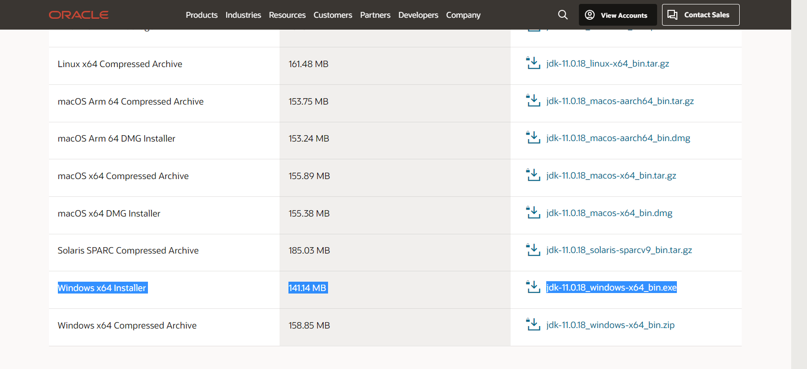
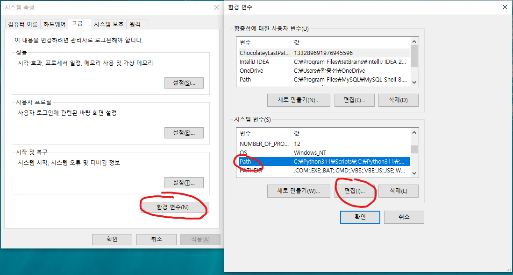
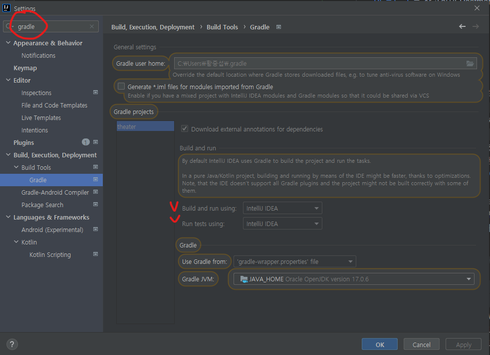
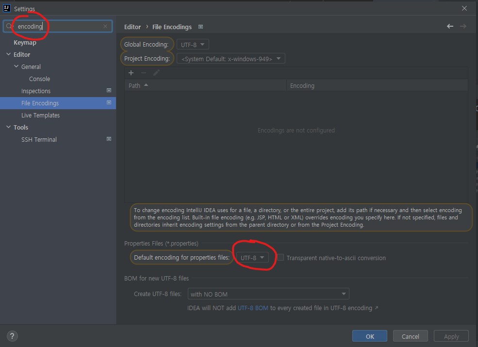
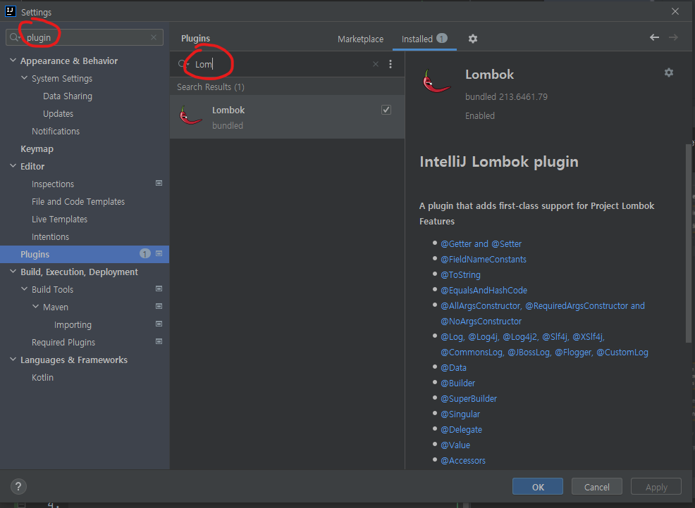
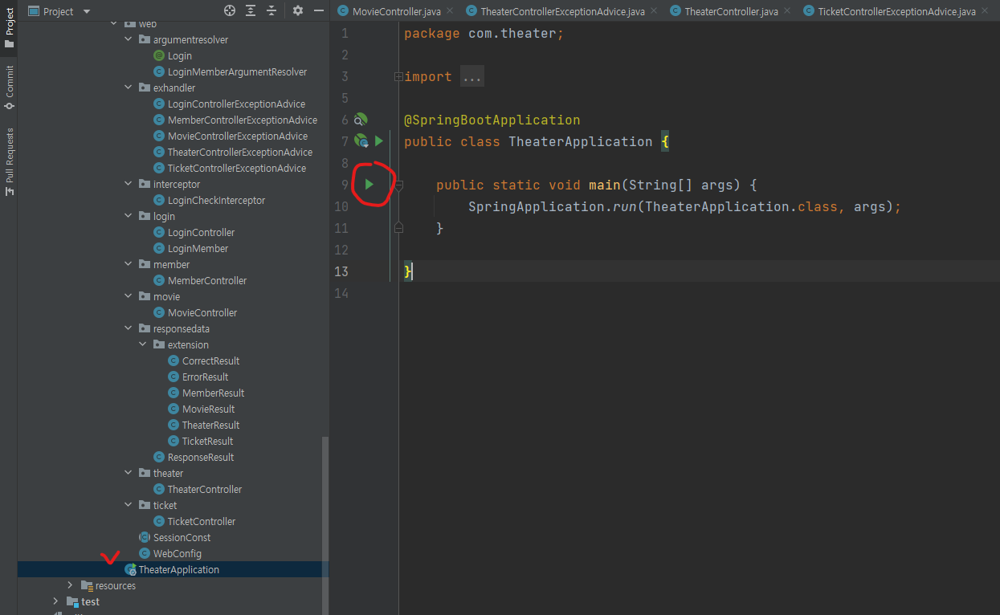
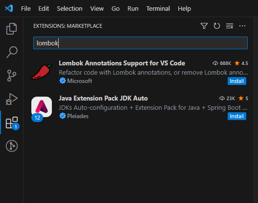
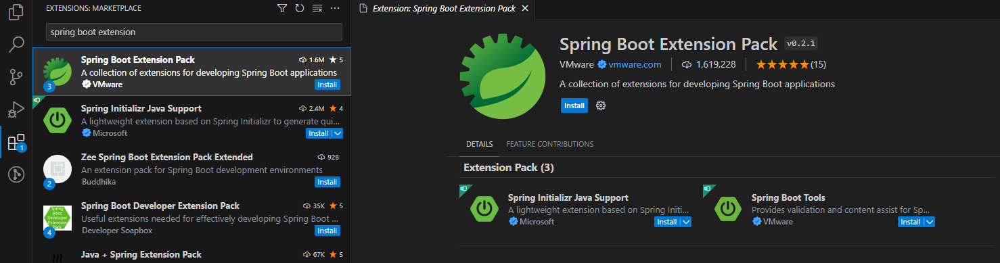
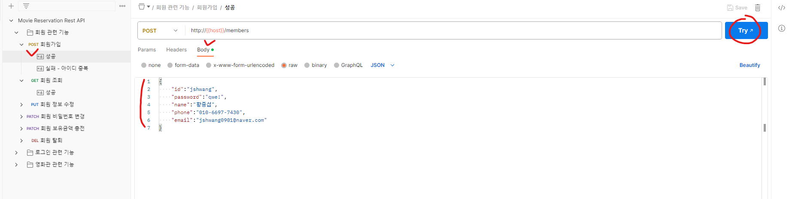

# Movie Reservation Rest API

## 1. 개요
서비스에 가입한 회원에 대하여 영화 조회 및 예매 기능을 지원하는 API입니다.

다음과 같이 기능을 합니다.

1. **회원 관련 기능**: 회원가입, 회원 조회, 회원정보 수정, 비밀번호 변경, 보유금액 충전
2. **로그인 관련 기능**: 로그인, 로그아웃
3. **영화 관련 기능**: 영화 조회, 상영일정 조회, 티켓 구매, 티켓 조회, 티켓 환불

API에 관한 자세한 명세는 
<a href="https://documenter.getpostman.com/view/19274559/2s93sdYBgZ" target="_blank">이 레퍼런스</a>
를 참고해주시기 바랍니다.

## 2. 사전 설치할 프로그램
### 1) Java 11
#### Java 다운로드 방법

이 프로젝트는 Windows에서 Java 11을 사용하여 만들어졌기 때문에 이를 기준으로 설명하겠습니다.

1. <a href="https://www.oracle.com/java/technologies/javase/jdk11-archive-downloads.html" target="_blank">오라클 Java 11 설치 웹사이트</a>로 이동합니다.

2. OS 버전에 맞는 프로그램을 설치합니다. 예를 들어 Windows라면 Windows x64 Installer 를 설치합니다.

3. 다운로드받은 JDK 파일을 실행시켜 설치를 마무리합니다.

4. Window 키를 누르고, '환경 변수' 라고 검색하면 나오는 시스템 환경 변수 편집 프로그램을 누릅니다.

5. 시스템 속성 - 고급에서 환경변수를 클릭하면 환경변수 탭이 나오는데, 
이 중 시스템 변수에서 Path를 찾아 편집을 누릅니다.

6. 이 탭에서 새로만들기를 클릭해 Java의 bin 폴더 위치를 등록합니다.
보통 C:\Program Files\Java에 jdk파일이 위치하므로, `C:\Program Files\Java\jdk-11.0.13\bin`과 같이 위치를 등록해줍니다.

7. 등록이 끝났으면 명령 프롬프트 창을 열어 `set` 을 입력해 나오는 PATH 변수 중
방금 등록한 Java 위치가 있는지 확인하고, `java --version`을 입력해 
정상적으로 출력되는지 확인합니다.

### 2) IntelliJ 또는 VS Code
#### IntelliJ 다운로드 방법

<a href="https://velog.io/@bi-sz/IntelliJ-%ED%99%98%EA%B2%BD-%EA%B5%AC%EC%84%B1%ED%95%98%EA%B8%B0" target="_blank">이 블로그</a>
를 참고하여 IntelliJ를 설치하면 됩니다.

### 3) Postman
#### postman 다운로드 방법

<a href="https://nhj12311.tistory.com/393" target="_blank">이 블로그</a>
를 참고하여 Postman을 설치하면 됩니다.

## 3. 실행 방법
### 1) 초기 세팅
IntelliJ를 사용하는 경우와 VS Code를 사용하는 경우를 나눠서 설명합니다.

#### IntellJ를 사용하는 경우
1. 해당 깃허브 저장소에서 로컬로 클론한 후에 인텔리제이를 실행합니다.

2. 인텔리제이 초기화면에서 `Open`, 또는 `Open or Import`를 클릭합니다.

3. 클론한 폴더로 찾아가 그 하위 파일인 build.gradle을 클릭합니다.

4. 이후 나오는 창에서 `Open as Project`를 클릭하면, 자동으로 외부 라이브러리 설치 등 필요한 작업을 진행합니다.

5. 모든 작업이 완료되면 상단 메뉴에서 File > Settings를 클릭합니다. Settings 탭에서 다음의 네가지를 설정해주어야 합니다.

   1. Gradle 메뉴에서, 인텔리제이를 사용해 프로젝트가 실행되도록 변경한 뒤 적용해줍니다.
   

   2. Annotation Processors 메뉴에서, Enable annotation processing에 체크한 뒤 적용해줍니다.
   

   3. File Encodings 메뉴에서, Default encoding for properties files을
   UTF-8로 변경한 뒤 적용해줍니다.
   
   
   4. Plugins 메뉴에서, Lombok을 검색해 이를 설치합니다.
   사진상으로는 이미 제 로컬에 Lombok이 설치되어있어 Installed에 위치해있지만, Marketplace에서 검색해야 합니다.
   

6. TheaterApplication 자바 파일을 열어 왼쪽에 초록색 실행 버튼을 클릭합니다.
   (Shift를 두번 누르면 필요한 파일 이름을 검색해 찾을 수 있습니다.)
이렇게 하면 스프링부트 내부적으로 로컬에서 8080번 포트를 사용해 톰캣 서버를 실행시킵니다.
즉, `http://localhost:8080` URL을 이용해 해당 Rest API를 테스트해볼 수 있습니다.

#### VS Code를 사용하는 경우
1. VS Code에서 확장 플러그인 두 가지를 설치합니다.
   1. Lombok Annotations Support for VS Code
   2. Java Extension Pack JDK Auto
   
   

2. 해당 깃허브 저장소에서 로컬로 클론한 폴더를 VS Code로 엽니다.
3. 그 폴더 안의 build.gradle 파일을 열면 자동으로 필요한 플러그인을 다운로드받고 빌드를 진행합니다.
만약 빌드가 정상적으로 되지 않는다면 Spring Boot Extension Pack을 수동으로 설치하고 다시 빌드합니다.

4. 빌드가 모두 완료되면 VS Code 좌측 버튼 중 `Run and Debug`을 클릭합니다. 
이후 중앙 상단에 뜨는 것 중 Java를 클릭해 프로젝트를 실행합니다.
이렇게 하면 스프링부트 내부적으로 로컬에서 8080번 포트를 사용해 톰캣 서버를 실행시킵니다.
즉, `http://localhost:8080` URL을 이용해 해당 Rest API를 테스트해볼 수 있습니다.

### 2) Postman으로 API 요청 및 응답 확인
API별 자세한 요청 및 응답 스펙은 앞서 설명드린대로
<a href="https://documenter.getpostman.com/view/19274559/2s93sdYBgZ" target="_blank">해당 레퍼런스</a>
를 확인해주시기 바랍니다.

이 레퍼런스 페이지에서 우측 상단 `Run in Postman`을 클릭하면 해당 Rest API에 관한 워크스페이스를 본인의 게정으로 가져올 수 있습니다.

이렇게 가져온 워크스페이스에서 요청 및 응답을 확인할 수 있습니다. 각각의 API마다 성공, 실패 케이스가 나눠지는데 원하는 케이스를 눌러서 테스트하면 됩니다.

예를 들어 회원가입 요청 성공 케이스를 테스트하려면 해당 탭을 열어서 좌측의 Try 버튼을 클릭합니다.
보내는 요청 스펙은 Body 탭에서 확인할 수 있습니다.

